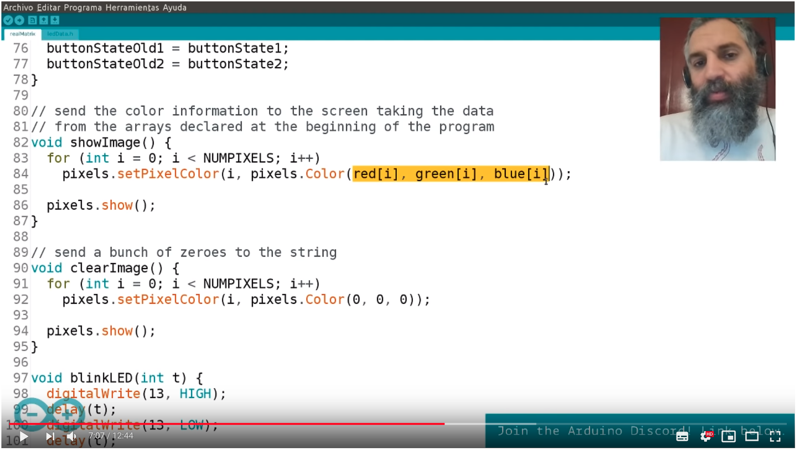

# Arduino Livecast

The Arduino Livecast is an initiative inviting everyone to try making projects with digital electronics. D. Cuartielles with the help of Malmo University students: Josefine and Karl, runs a weekly YouTube segment where he talks, demoes, and discusses technology. 

The videos show projects made with Arduino UNO, MKR, NeoPixels, motors, buttons, LEDs ... and code. Feel free to download this repository, try it out, improve it, and send us comments. We will be glad to incorporate your ideas into future shows.

Follow Arduino on [YouTube](https://www.youtube.com/subscription_center?add_user=arduinoteam), [Discord](https://discord.gg/KjW5CKp), and the [Arduino Forum](https://forum.arduino.cc). Join us and let's have fun learning together.

## Credits

Thanks to:

* The EU project *eCraft2Learn* that has kindly sponsored the birth of this livecast
* Josefine & Karl from Malmo University
* Our online contributors: [per1234](https://github.com/per1234)
