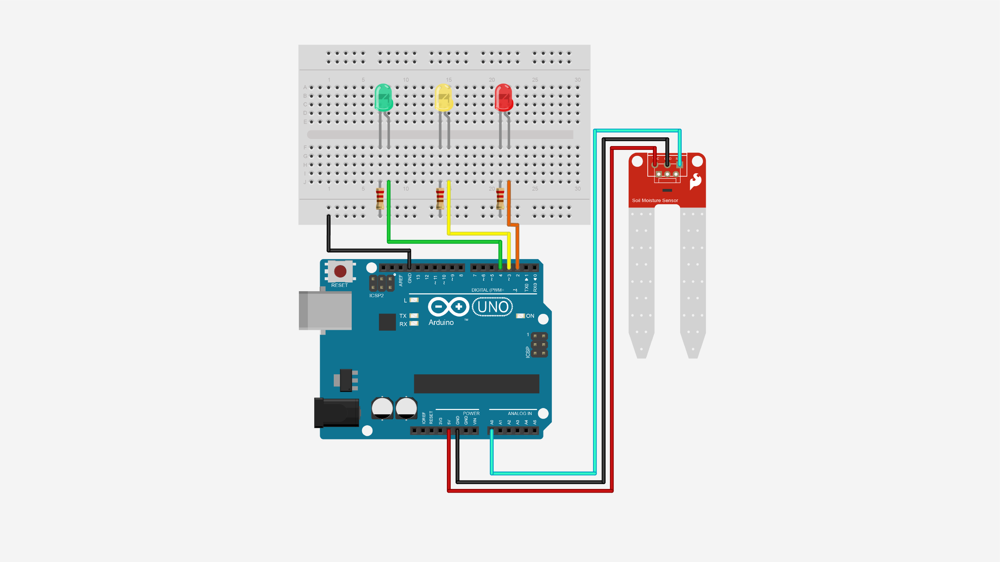

# Episode 1 - Hack your plant


This example will allow you collect data from your plant and give you notifications depending on the moist level of the plant. We are going to use a moist sensor and a couple of LEDs to indicate whether we have to water the plant or not.

## Ingredients

- Arduino UNO (or any other Arduino boards)
- Moist sensor
- 1x red LED, 1x yellow LED, 1x green LED
- 3x 220ohm resistors
- Jumper wires


## Wiring
##### Connect the wires and components according to the fritzing below.



## Code

```sh
int potPin = A0;    // select the input pin for the potentiometer
int redLed = 2;   // select the pin for the LED
int yellowLed = 3;   // select the pin for the LED
int greenLed = 4;   // select the pin for the LED

int val = 0;       // variable to store the value coming from the sensor

void setup() {
  pinMode(redLed, OUTPUT);  // declare the ledPin as an OUTPUT
  pinMode(yellowLed, OUTPUT);  // declare the ledPin as an OUTPUT
  pinMode(greenLed, OUTPUT);  // declare the ledPin as an OUTPUT
  Serial.begin(9600);
}

void loop() {
  val = analogRead(potPin);    // read the value from the sensor
  Serial.println(val); // print the value to set thresholds

  //red
  if (val >= 900 && val <= 1023) { //set your own thresholds dependent on values
    digitalWrite(redLed, HIGH);  // turn the ledPin on
  }
  else {
    digitalWrite(redLed, LOW);
  }

  //orange
  if (val >= 501 && val <= 899) { //set your own thresholds dependent on values
    digitalWrite(yellowLed, HIGH);  // turn the ledPin on
  }
  else {
    digitalWrite(yellowLed, LOW);
  }

  //green
  if (val > 0 && val <= 500) { //set your own thresholds dependent on values
    digitalWrite(greenLed, HIGH);  // turn the ledPin on
  }
  else {
    digitalWrite(greenLed, LOW);
  }
}
```

## Start using

After wiring and uploading the code, it is time to test it! 
- First we can try it out on a dry plant. It will generate a value that most likely is over 900, which will turn on the Red LED.
- If we water the plant just a little bit and then try the moist sensor again, it will generate a different value, most likely between 500 & 900, and that will turn the Yellow LED on.
- If we drown the plant in water, the moist sensor will give a very low value, which will turn on the Green LED.

## Outcome

We have in this example created a functional moist-o-meter, which will notify you the state of your plant. High moist equals a low value, whereas low moist equals a high value. You can now find your own treshold and start hacking your plant!


