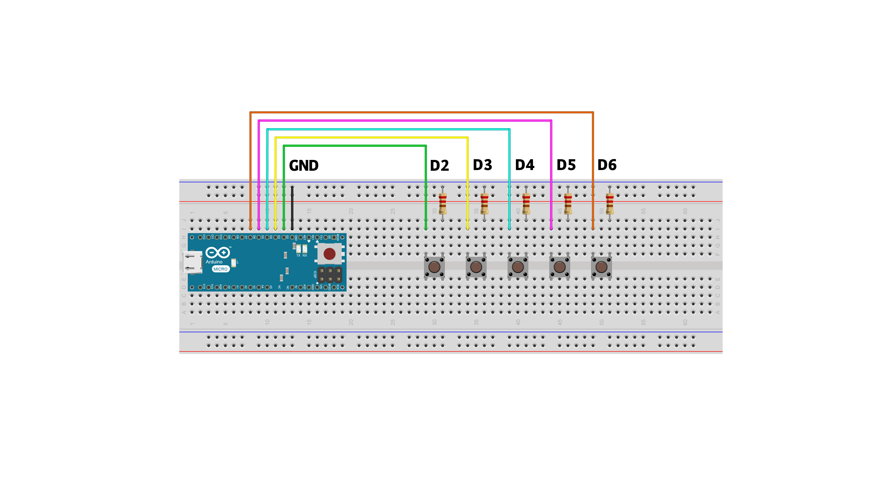

# Episode 3 - Retro Game Control
This example will allow you to play your favourite retro game with an Arduino-built controller by using keypresses. This example has 5 buttons that each simulates a keypress that we have created. 


## Ingredients
- Arduino Micro
- 5 buttons
- 5 resistors
- Jumper wires (female to male recommended for mapping out your controls)


## Wiring
#### Connect the wires and components according to the fritzing below.



## Code

```sh
#include "Keyboard.h"

//declaring button pins
const int buttonPin = 2;          
const int buttonPin1 = 3;
const int buttonPin2 = 4;   
const int buttonPin3 = 5;
const int buttonPin4 = 6;


int previousButtonState = HIGH; 
int previousButtonState1 = HIGH;
int previousButtonState2 = HIGH;
int previousButtonState3 = HIGH;
int previousButtonState4 = HIGH;


void setup() {
  //declare the buttons as input_pullup
  pinMode(buttonPin, INPUT_PULLUP);
  pinMode(buttonPin1, INPUT_PULLUP);
  pinMode(buttonPin2, INPUT_PULLUP);
  pinMode(buttonPin3, INPUT_PULLUP);
  pinMode(buttonPin4, INPUT_PULLUP);
  
  Keyboard.begin();
}

void loop() {
  //checking the state of the button
  int buttonState = digitalRead(buttonPin);
  int buttonState1 = digitalRead(buttonPin1);
  int buttonState2 = digitalRead(buttonPin2);
  int buttonState3 = digitalRead(buttonPin3);
  int buttonState4 = digitalRead(buttonPin4);
  
 //replaces button press with UP arrow
  if (buttonState == LOW && previousButtonState == HIGH) {
      // and it's currently pressed:
    Keyboard.press(218);
  }

  if (buttonState == HIGH && previousButtonState == LOW) {
      // and it's currently released:
    Keyboard.release(218);
  }
  
  //replaces button press with DOWN arrow
if (buttonState1 == LOW && previousButtonState1 == HIGH) {
      // and it's currently pressed:
    Keyboard.press(217);
  }

  if (buttonState1 == HIGH && previousButtonState1 == LOW) {
      // and it's currently released:
    Keyboard.release(217);
  }
  
  //replaces button press with RIGHT arrow
  if (buttonState2 == LOW && previousButtonState2 == HIGH) {
      // and it's currently pressed:
    Keyboard.press(215);
  }

  if (buttonState2 == HIGH && previousButtonState2 == LOW) {
      // and it's currently released:
    Keyboard.release(215);
  }
  
  //replaces button press with LEFT arrow
   if (buttonState3 == LOW && previousButtonState3 == HIGH) {
      // and it's currently pressed:
    Keyboard.press(216);
  }

  if (buttonState3 == HIGH && previousButtonState3 == LOW) {
      // and it's currently released:
    Keyboard.release(216);
  }
  
//replaces button press with SPACE BAR
if (buttonState4 == LOW && previousButtonState4 == HIGH) {
      // and it's currently pressed:
    Keyboard.press(32);
  }

  if (buttonState4 == HIGH && previousButtonState4 == LOW) {
      // and it's currently released:
    Keyboard.release(32);
  }

  //checking the previous state of the button
  
  previousButtonState = buttonState;
  previousButtonState1 = buttonState1;
  previousButtonState2 = buttonState2;
  previousButtonState3 = buttonState3;
  previousButtonState4 = buttonState4;

}

```

## Start using

After wiring and uploading the code, we can now start using the controller. What happens in the code is that if a button is pressed, it will simulate a specific keypress. For example, Keyboard.press(218); will be the same as using the UP arrow on your regular keyboard. For a complete reference list of what keycodes you want to use, check out: 
- <https://www.arduino.cc/en/Reference/KeyboardModifiers> 
- <http://www.asciitable.com/> 


## Outcome

With this knowledge you can start exploring different ways of interacting with your computer, it doesn't have to be confined to games. You can for example find the keycode for your volume buttons on your computer, or make a very large space bar for aggressive writing sessions. 

After completing this example, we can also encourage you to create your own set of buttons, by using copper tape and simple materials you can find at home. 


