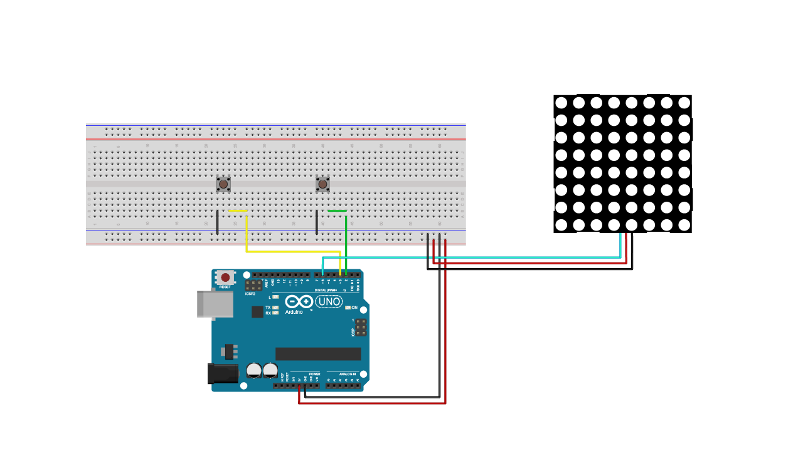
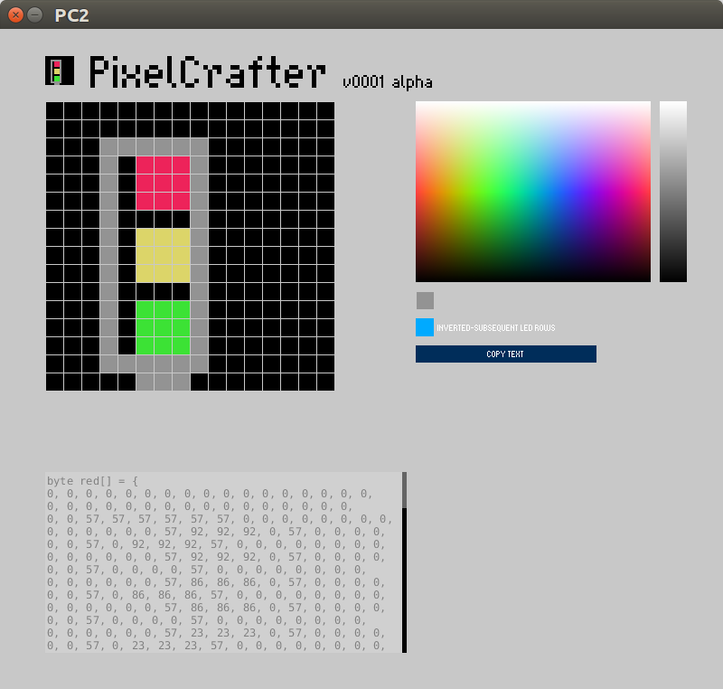

# Episode 6 - LED Matrix 
This example will allow you to modify your LED matrix with different arrays, and be able to turn it on/off with two buttons.


## Ingredients
* Arduino UNO
* LED Matrix (in this example a 16x16)
* 2 buttons
* Jumper wires 


## Wiring

*Connect the wires and components according to the fritzing below.*



## PixelCrafter



Modify the *ledData.h* file to represent whatever you want to using this Processing sketch. For using it you will need to:

* install Processing from [https://processing.org]
* double click on the *PC2.pde* file, what will open the sketch into the Processing IDE
* click on the *play* button and start drawing
* click on the *inverted-subsequent led rows* checkbox (this is needed because LED matrixes are like a long strip of LEDs where every other row is going from right to left
* click on the *copy text* button to copy the code version of your drawing
* paste the code in the *ledData.h* file, and upload it to your Arduino board

## Code

```sh
/*
    NeoMatrix with two buttons
    Control a NeoPixel LED matrix using two buttons.
    The LED data is stored in arrays, allowing the generation of
    possible "screens" using external software
    (c) 2018 Karl, Josefine, and David for Arduino
    this code is GPLv3
    based on code by Shae Erisson (c) 2013
*/

#include <Adafruit_NeoPixel.h>
#include "ledData.h"

#ifdef __AVR__
#include <avr/power.h>
#endif

// NeoPixel string is connected to pin 6
#define PIN            6

// size of the LED matrix: 16x16
#define NUMPIXELS      256

// create the NeoPixel object
Adafruit_NeoPixel pixels = Adafruit_NeoPixel(NUMPIXELS, PIN, NEO_GRB + NEO_KHZ800);

// variables to control the buttons
// by default they have to be "HIGH"
// because of using the internal pullup
int buttonPin1 = 2;
int buttonPin2 = 3;
int buttonState1 = HIGH;
int buttonState2 = HIGH;
int buttonStateOld1 = HIGH;
int buttonStateOld2 = HIGH;

// see the other tab for checking
// the arrays storing the LED data

void setup() {
  // init the NeoPixel matrix
  pixels.begin();

  // configure the buttons with internal pullup resistors
  pinMode(buttonPin1, INPUT_PULLUP);
  pinMode(buttonPin2, INPUT_PULLUP);
}

void loop() {
  // check the status of the buttons
  buttonState1 = digitalRead(buttonPin1);
  buttonState2 = digitalRead(buttonPin2);

  // if button 1 is pressed, load the image
  if (buttonState1 == LOW && buttonStateOld1 == HIGH)
    showImage();

  // if button 2 is pressed, clear the image
  if (buttonState2 == LOW && buttonStateOld2 == HIGH)
    clearImage();

  // update the button states
  buttonStateOld1 = buttonState1;
  buttonStateOld2 = buttonState2;
}

// send the color information to the screen taking the data
// from the arrays declared at the beginning of the program
void showImage() { 
  for (int i = 0; i < NUMPIXELS; i++)
    pixels.setPixelColor(i, pixels.Color(red[i], green[i], blue[i]));
  
  pixels.show();
}

// send a bunch of zeroes to the string
void clearImage() {
  for (int i = 0; i < NUMPIXELS; i++)
    pixels.setPixelColor(i, pixels.Color(0, 0, 0));

  pixels.show();
}
```
## *IMPORTANT: You will also have to download the ledData.h file
## Start using

After wiring and uploading the code, we can now start making our own 'pictures' on the LED matrix. What we need to modify is the ledData.h file, which contains 3 different arrays: red, green & blue. Each array has 256 numbers. For example, if we want to modify pixel number 35, we go to number 35 in the array, and write a value between 1-256 to set the brightness of it. 

In combination with this code, we can also use a tool call PixelCrafter, a Processing powered application where we can draw a picture with different colours, and then export it in the form of arrays. 


## Outcome

In this example we have gone through how an LED matrix works, and how arrays are used. We have also showed how we can call upon different functions and how we use an external file for data. 


