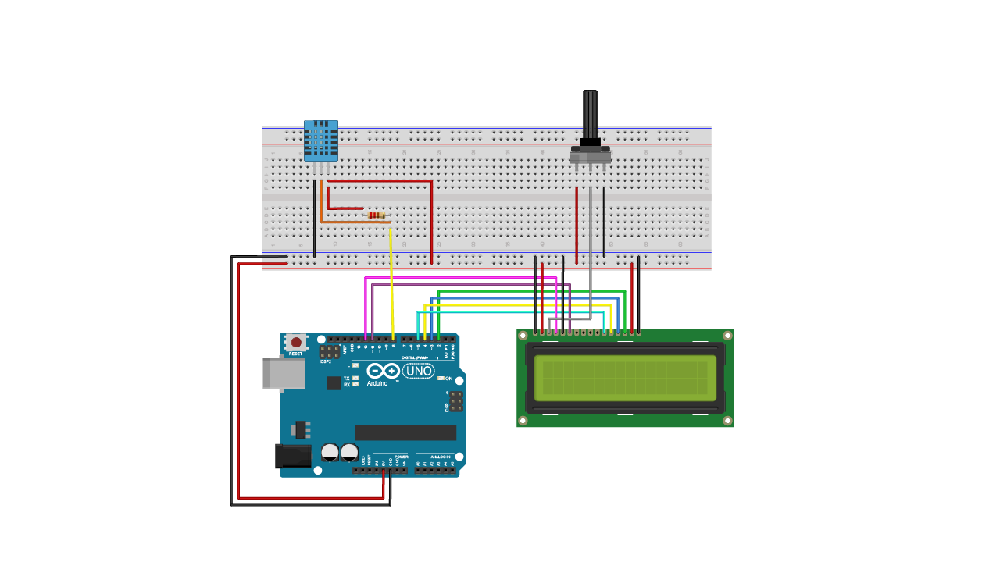

# Episode 7 - Temperature & Humidity display
This example will measure the temperature and humidity of your surroundings and print it on an LCD display. 


## Ingredients
- Arduino UNO
- 1x LCD displau
- 1x DHT11 temperature & humidity sensor (3 pin)
- Potentiometer
- 1x 220 ohm resistor
- Jumper wires 


## Wiring
 *Connect the wires and components according to the fritzing below.*



## Code

```sh

/*
    Digital Humidity & Temperature Sensor (DHT)
    that prints the values of the DHT on an
    LCD screen.

    (c) 2018 Karl, Josefine & David for Arduino

    based on code by ThothLoki (c) 2016

*/

#include <LiquidCrystal.h>
#include "DHT.h"

// set the DHT Pin
#define DHTPIN 8

//define LCD pins
LiquidCrystal lcd(12, 11, 5, 4, 3, 2);
#define DHTTYPE DHT11
DHT dht(DHTPIN, DHTTYPE);


void setup() {
  //starts LCD
  lcd.begin(16, 2);
  //starts DHT
  dht.begin();
  
  lcd.print("Temp:    Humid:");
}

void loop() {
  delay(500);
  
  //set location of where text will begin
  lcd.setCursor(0, 1);
  
  // reads humidity
  float h = dht.readHumidity();
  
  //reads temperature (celsius)
  float c = dht.readTemperature();
  
  //reads temperature (fahrenheit)
  float f = dht.readTemperature(true);

  
  if (isnan(h) || isnan(c)) {
    lcd.print("ERROR");
    return;
  }
  //prints temperature. to display fahrenheit, replace 'c' with an 'f'
  lcd.print(c);
  lcd.setCursor(9,1);
  //prints humidity
  lcd.print(h);

  
}

```

## Start using

After wiring and uploading the code, we can now start tracking the temperature & humidity. The values of the sensor will be printed on the LCD screen, and will appear where you have set the cursor.
For e.g. **lcd.setCursor(0, 1);** will be the upper left corner of the screen. We have in this example used a DHT module, but you can further on try it out with different sensors that you want to display on the LCD.


## Outcome

This example shows how we can grab the value of a sensor, in this case temperature & humidity, and have it printed on an LCD display. You can also try out different types of sensor, for e.g. a photoresistor to measure light, see if a button is being pressed or not or perhaps using the UNO's gyroscope to display its positions on the LCD. By having a visual data representation we can easily measure our surroundings, and it is a good method to use if you are doing a portable device. 


